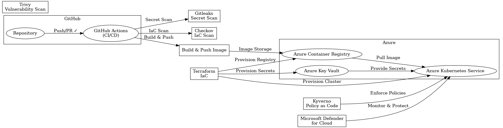

# Zero-Trust Secure Software Supply Chain on Azure

A production-ready implementation of a secure CI/CD pipeline using GitHub Actions to deploy a containerized Python Flask application to Azure Kubernetes Service (AKS) with comprehensive zero-trust security controls.

## Table of Contents
- [Overview](#overview)
- [Architecture](#architecture)
- [Why Zero-Trust?](#why-zero-trust)
- [Features](#features)
- [Prerequisites](#prerequisites)
- [Quick Start](#quick-start)
- [Detailed Setup](#detailed-setup)
- [Project Structure](#project-structure)
- [Security Controls](#security-controls)
- [Monitoring and Observability](#monitoring-and-observability)
- [Operations](#operations)
- [Troubleshooting](#troubleshooting)
- [Contributing](#contributing)
- [License](#license)

## Overview

This project demonstrates enterprise-grade DevSecOps practices by implementing a complete zero-trust secure software supply chain on Azure. It includes infrastructure as code, automated security scanning, container orchestration, and comprehensive monitoring.

### Key Objectives
- Implement zero-trust security principles throughout the software development lifecycle
- Automate security scanning and validation at every stage
- Deploy production-ready infrastructure on Azure
- Establish comprehensive monitoring and observability
- Provide operational runbooks and incident response procedures

## Architecture



### Architecture Components

**Application Layer:**
- Flask REST API with Prometheus metrics
- Structured JSON logging
- Health check endpoints
- Comprehensive error handling

**Infrastructure Layer:**
- Azure Kubernetes Service (AKS) with network policies
- Azure Container Registry (ACR) with image scanning
- Azure Key Vault for secrets management
- Log Analytics for centralized logging
- Virtual Network with Network Security Groups

**Security Layer:**
- Gitleaks for secret detection
- Checkov for IaC security scanning
- Trivy for container vulnerability scanning
- Kyverno for Kubernetes policy enforcement
- Azure Policy for compliance

**Monitoring Layer:**
- Prometheus for metrics collection
- Grafana for visualization
- Azure Monitor for infrastructure monitoring
- Custom alerts and SLOs

## Why Zero-Trust?

### Core Principles

1. **Never Trust, Always Verify**
   - Every request is authenticated and authorized
   - No implicit trust based on network location
   - Continuous validation throughout the pipeline

2. **Least Privilege Access**
   - Minimal permissions at every layer
   - Role-based access control (RBAC)
   - Workload identity for service-to-service communication

3. **Assume Breach**
   - Network segmentation with policies
   - Runtime security monitoring
   - Comprehensive audit logging

4. **Shift-Left Security**
   - Security scanning in development
   - Automated policy enforcement
   - Fast feedback loops

## Features

### Application Features
- RESTful API with multiple endpoints
- Prometheus metrics integration
- Structured logging with correlation IDs
- Health, readiness, and liveness probes
- Comprehensive test coverage (>80%)

### Infrastructure Features
- Infrastructure as Code (Terraform)
- Auto-scaling node pools
- Network isolation and policies
- Private container registry
- Secrets management with Key Vault

### Security Features
- Multi-stage security scanning
- Policy-as-Code with Kyverno
- Non-root container execution
- Read-only root filesystem
- Security context constraints

### Operational Features
- Automated deployments with rollback
- Comprehensive monitoring and alerting
- Incident response procedures
- SLO tracking and reporting
- Operational runbooks

## Prerequisites

### Required Tools and Versions

| Tool | Minimum Version | Installation |
|------|----------------|--------------|
| Azure CLI | 2.50.0 | [Install](https://docs.microsoft.com/en-us/cli/azure/install-azure-cli) |
| Terraform | 1.0.0 | [Install](https://www.terraform.io/downloads) |
| kubectl | 1.28.0 | [Install](https://kubernetes.io/docs/tasks/tools/) |
| Docker | 24.0.0 | [Install](https://docs.docker.com/get-docker/) |
| Python | 3.11+ | [Install](https://www.python.org/downloads/) |
| Git | 2.40.0 | [Install](https://git-scm.com/downloads/) |
| Helm | 3.12.0 | [Install](https://helm.sh/docs/intro/install/) |

### Azure Requirements
- Active Azure subscription
- Permissions to create:
  - Resource Groups
  - AKS Clusters
  - Container Registries
  - Key Vaults
  - Virtual Networks
  - Managed Identities
- Azure AD tenant access

### GitHub Requirements
- GitHub account with repository access
- Ability to configure repository secrets
- GitHub Actions enabled

## Quick Start

```bash
# 1. Clone the repository
git clone https://github.com/yourusername/zero-trust.git
cd zero-trust

# 2. Login to Azure
az login
az account set --subscription <subscription-id>

# 3. Initialize and deploy infrastructure
cd terraform
terraform init
terraform plan -out=tfplan
terraform apply tfplan

# 4. Configure kubectl
az aks get-credentials \
  --resource-group rg-zero-trust-prod \
  --name aks-zero-trust

# 5. Install monitoring stack
helm repo add prometheus-community https://prometheus-community.github.io/helm-charts
helm install prometheus prometheus-community/kube-prometheus-stack \
  --namespace monitoring --create-namespace

# 6. Install policy engine
helm repo add kyverno https://kyverno.github.io/kyverno/
helm install kyverno kyverno/kyverno \
  --namespace kyverno --create-namespace

# 7. Apply policies
kubectl apply -f policies/kyverno-policies.yaml

# 8. Deploy application (via CI/CD or manual)
kubectl apply -f k8s/
```

## Detailed Setup

See [docs/DEPLOYMENT.md](docs/DEPLOYMENT.md) for comprehensive deployment instructions.

### 1. Infrastructure Setup

```bash
cd terraform
cp terraform.tfvars.example terraform.tfvars
# Edit terraform.tfvars with your values
terraform init
terraform plan -out=tfplan
terraform apply tfplan
```

### 2. Configure GitHub Secrets

Create the following secrets in your GitHub repository:

```bash
# Create Azure service principal
az ad sp create-for-rbac \
  --name "github-actions-zero-trust" \
  --role contributor \
  --scopes /subscriptions/<subscription-id>/resourceGroups/rg-zero-trust-prod \
  --sdk-auth > azure-credentials.json
```

Add these secrets to GitHub:
- `AZURE_CREDENTIALS`: Content of azure-credentials.json
- `ACR_NAME`: acrzerotrust
- `AZURE_RESOURCE_GROUP`: rg-zero-trust-prod
- `AKS_CLUSTER_NAME`: aks-zero-trust

### 3. Deploy Application

Push code to trigger automated deployment:

```bash
git add .
git commit -m "Initial deployment"
git push origin main
```

Or deploy manually:

```bash
export ACR_NAME="acrzerotrust"
export APP_NAME="zero-trust-app"
export IMAGE_TAG="v1.0.0"

kubectl apply -f k8s/service-account.yaml
kubectl apply -f k8s/deployment.yaml
kubectl apply -f k8s/service.yaml
kubectl apply -f k8s/network-policy.yaml
kubectl apply -f k8s/ingress.yaml
```

### 4. Verify Deployment

```bash
# Check pod status
kubectl get pods -n zero-trust

# View logs
kubectl logs -f deployment/zero-trust-app -n zero-trust

# Test health endpoint
kubectl port-forward -n zero-trust svc/zero-trust-app 8080:80
curl http://localhost:8080/health
```

## Project Structure

```
zero-trust/
├── App/                          # Application code
│   ├── src/
│   │   └── app.py               # Flask application
│   ├── Dockerfile               # Container image definition
│   ├── requirements.txt         # Python dependencies
│   └── requirements-dev.txt     # Development dependencies
├── terraform/                    # Infrastructure as Code
│   ├── main.tf                  # Main Terraform configuration
│   ├── variables.tf             # Variable definitions
│   ├── outputs.tf               # Output values
│   ├── backend.tf               # Remote state configuration
│   └── terraform.tfvars.example # Example variables
├── k8s/                         # Kubernetes manifests
│   ├── deployment.yaml          # Application deployment
│   ├── service.yaml             # Service definition
│   ├── ingress.yaml             # Ingress configuration
│   ├── network-policy.yaml      # Network policies
│   └── service-account.yaml     # Service account
├── .github/workflows/           # CI/CD pipelines
│   ├── ci.yml                   # Continuous Integration
│   └── deploy.yml               # Continuous Deployment
├── tests/                       # Test suite
│   ├── conftest.py              # Pytest configuration
│   └── test_app.py              # Application tests
├── monitoring/                  # Monitoring configuration
│   ├── prometheus-config.yaml   # Prometheus configuration
│   ├── alerts.yaml              # Alert rules
│   └── grafana-dashboards/      # Grafana dashboards
├── policies/                    # Policy definitions
│   └── kyverno-policies.yaml    # Kyverno policies
├── docs/                        # Documentation
│   ├── DEPLOYMENT.md            # Deployment guide
│   ├── TROUBLESHOOTING.md       # Troubleshooting guide
│   ├── RUNBOOKS.md              # Operational runbooks
│   ├── INCIDENT_RESPONSE.md     # Incident response plan
│   └── SLO.md                   # Service Level Objectives
├── pytest.ini                   # Pytest configuration
├── .gitignore                   # Git ignore rules
├── README.md                    # This file
├── CONTRIBUTING.md              # Contribution guidelines
├── SECURITY.md                  # Security policy
└── LICENSE                      # License file
```

## Security Controls

### Pipeline Security

**1. Secret Detection (Gitleaks)**
- Scans all commits for hardcoded secrets
- Runs on every push and pull request
- Prevents credential leaks

**2. Infrastructure Security (Checkov)**
- Validates Terraform configurations
- Checks for security misconfigurations
- Enforces best practices

**3. Container Security (Trivy)**
- Scans container images for vulnerabilities
- Checks for CVEs in dependencies
- Blocks high-severity vulnerabilities

**4. Code Quality**
- Black for code formatting
- Flake8 for linting
- MyPy for type checking
- Bandit for security issues
- Safety for dependency vulnerabilities

### Runtime Security

**1. Kubernetes Policies (Kyverno)**
- Enforces non-root containers
- Requires read-only root filesystem
- Validates image sources
- Blocks privilege escalation

**2. Network Policies**
- Default deny all traffic
- Explicit allow rules
- Namespace isolation
- Service-to-service encryption

**3. Pod Security**
- Security context constraints
- Resource limits
- Capabilities dropped
- Seccomp profiles

**4. Access Control**
- RBAC for Kubernetes
- Workload identity for Azure
- Least privilege principles
- Service accounts per workload

## Monitoring and Observability

### Metrics

**Application Metrics:**
- Request rate and latency
- Error rates by endpoint
- Active request count
- HTTP status code distribution

**Infrastructure Metrics:**
- CPU and memory utilization
- Pod restarts and failures
- Node health and capacity
- Network traffic

### Logging

**Structured Logging:**
- JSON format for parsing
- Correlation IDs for tracing
- Log levels (INFO, WARNING, ERROR)
- Centralized in Azure Monitor

### Alerting

**Critical Alerts:**
- Application down
- High error rate (>5%)
- Security policy violations
- Resource exhaustion

**Warning Alerts:**
- High latency
- Elevated error rate
- Pod restarts
- Resource pressure

### Dashboards

Access Grafana dashboards:
```bash
kubectl port-forward -n monitoring svc/grafana 3000:80
# Open http://localhost:3000
```

## Operations

### Common Operations

**View Application Logs:**
```bash
kubectl logs -f deployment/zero-trust-app -n zero-trust
```

**Scale Application:**
```bash
kubectl scale deployment zero-trust-app -n zero-trust --replicas=5
```

**Restart Application:**
```bash
kubectl rollout restart deployment/zero-trust-app -n zero-trust
```

**Rollback Deployment:**
```bash
kubectl rollout undo deployment/zero-trust-app -n zero-trust
```

**Check Resource Usage:**
```bash
kubectl top pods -n zero-trust
kubectl top nodes
```

### Service Level Objectives

See [docs/SLO.md](docs/SLO.md) for detailed SLO definitions.

- **Availability:** 99.9% uptime
- **Success Rate:** 99.5% of requests
- **Latency (p95):** < 500ms
- **Latency (p99):** < 1000ms

### Operational Documentation

- [Deployment Guide](docs/DEPLOYMENT.md) - Detailed deployment instructions
- [Troubleshooting Guide](docs/TROUBLESHOOTING.md) - Common issues and solutions
- [Runbooks](docs/RUNBOOKS.md) - Standard operating procedures
- [Incident Response](docs/INCIDENT_RESPONSE.md) - Incident handling procedures
- [SLO Documentation](docs/SLO.md) - Service level objectives

## Troubleshooting

### Common Issues

**Pods Not Starting:**
```bash
kubectl describe pod <pod-name> -n zero-trust
kubectl logs <pod-name> -n zero-trust
kubectl get events -n zero-trust --sort-by='.lastTimestamp'
```

**Image Pull Errors:**
```bash
az acr login --name acrzerotrust
kubectl delete pod <pod-name> -n zero-trust
```

**Network Issues:**
```bash
kubectl get networkpolicies -n zero-trust
kubectl describe networkpolicy <policy-name> -n zero-trust
```

See [docs/TROUBLESHOOTING.md](docs/TROUBLESHOOTING.md) for comprehensive troubleshooting guide.

## Development

### Local Development

```bash
# Install dependencies
cd App
pip install -r requirements-dev.txt

# Run tests
pytest

# Run application locally
python src/app.py
```

### Running Tests

```bash
# Run all tests with coverage
pytest

# Run specific test file
pytest tests/test_app.py

# Run with verbose output
pytest -v
```

### Code Quality

```bash
# Format code
black App/src/

# Lint code
flake8 App/src/

# Type checking
mypy App/src/

# Security scan
bandit -r App/src/
```

## Contributing

We welcome contributions! Please see [CONTRIBUTING.md](CONTRIBUTING.md) for guidelines.

### Development Process

1. Fork the repository
2. Create a feature branch
3. Make your changes
4. Run tests and security scans
5. Submit a pull request

## Security

Security is our top priority. Please see [SECURITY.md](SECURITY.md) for:
- Reporting security vulnerabilities
- Security update policy
- Security best practices

## License

This project is licensed under the MIT License - see [LICENSE](LICENSE) file for details.

## Support

For questions or issues:
- Open a GitHub issue
- Check documentation in `/docs`
- Review troubleshooting guide

## Acknowledgments

This project uses:
- Flask for the web framework
- Prometheus for metrics
- Grafana for visualization
- Terraform for infrastructure
- Azure Kubernetes Service
- Kyverno for policy enforcement

## Resources

- [Azure AKS Documentation](https://docs.microsoft.com/en-us/azure/aks/)
- [Kubernetes Documentation](https://kubernetes.io/docs/)
- [Terraform Azure Provider](https://registry.terraform.io/providers/hashicorp/azurerm/latest/docs)
- [Zero Trust Architecture](https://www.nist.gov/publications/zero-trust-architecture)
- [Google SRE Book](https://sre.google/books/)

## Roadmap

Future enhancements:
- [ ] Multi-region deployment
- [ ] Advanced traffic management with service mesh
- [ ] Chaos engineering tests
- [ ] Machine learning for anomaly detection
- [ ] Advanced security analytics
- [ ] Cost optimization automation
